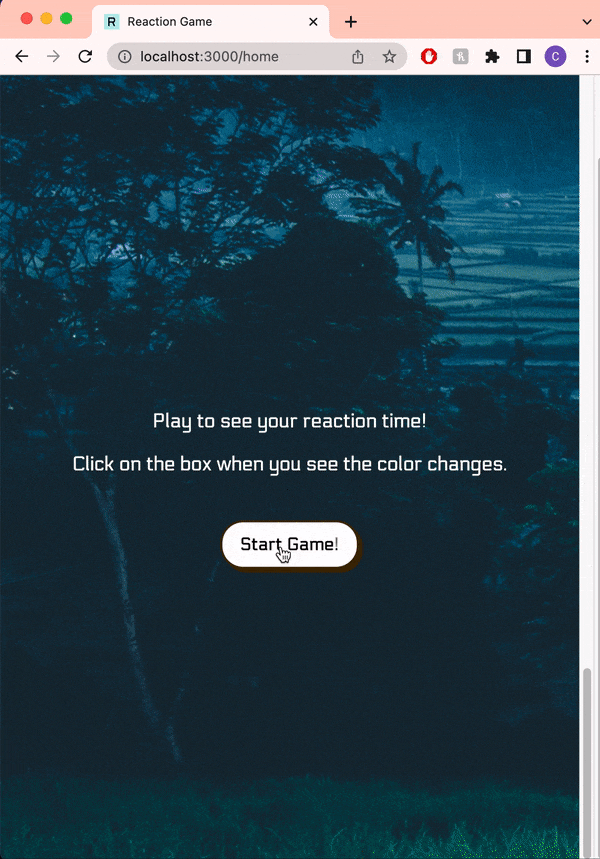
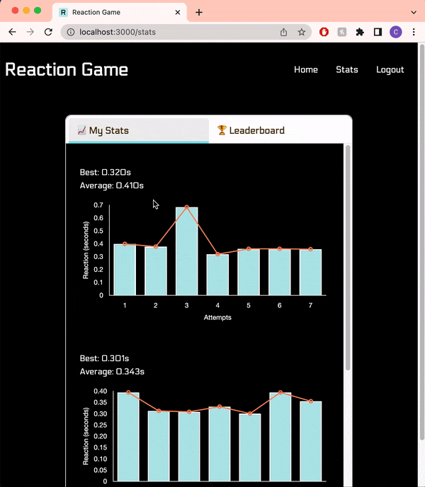

# Reaction Game

This repo is home for the codebase that powers Reaction Game, a web application game for users to test their reaction times.

- This app includes: user authentication, reaction game, users’ game records, and leaderboard.
- Game Info: Each time the box changes color, user should try to "react"/click as fast as they can. There are about 7-10 color changes in a game, so the app will track the user's reaction time to each color change. The results will show the user's best and average time from the game.
- Users can easily view and track the stats from their past games (data visualization implemented using Chartjs).

## Project Setup

1. Install NPM packages `npm install`
2. Create database `createdb reaction-game` and seed file `npm run seed`
3. Start server `npm start` and open http://localhost:3000 to view it in your browser

## Technologies used:

- [PostgreSQL](https://www.postgresql.org)
- [Sequelize](https://sequelize.org)
- [Express](https://expressjs.com)
- [React](https://reactjs.org)
- [Redux](https://redux.js.org)
- [Node.js](https://nodejs.org/en/)
- [JSON Web Token](https://jwt.io)
- [Chart.js](https://www.chartjs.org)
- [Framer Motion](https://www.framer.com/motion)
- [React-Spring: Parallax](https://www.react-spring.dev)

## Preview of Reaction Game

1. Game view:

    

2. My Stats & Leaderboard view:

    

